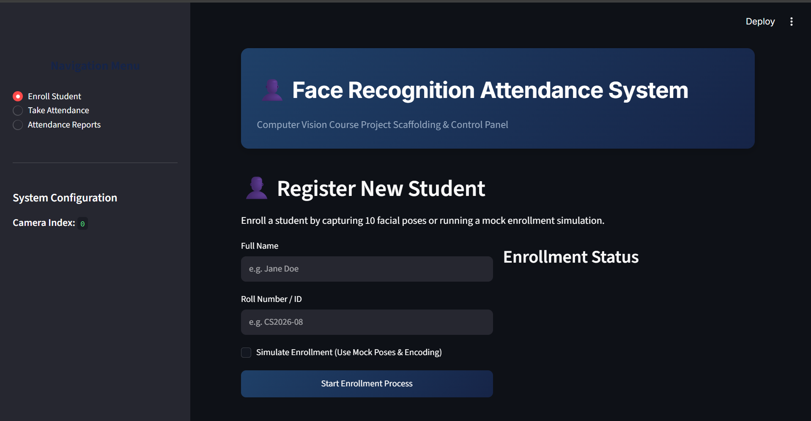

# Face Recognition Attendance Management System




The Face Recognition Attendance Management System is a computer vision-based biometric tracking application. It automates attendance registration by extracting 128-dimensional facial embeddings using a dlib-based deep neural network, managing student metadata in a local SQLite database, and providing a web control panel interface built with Streamlit.

---

## Technical Stack

| Component            | Technology              | Description                                                                                                                           |
| :------------------- | :---------------------- | :------------------------------------------------------------------------------------------------------------------------------------ |
| Programming Language | Python 3.8+             | Core application runtime                                                                                                              |
| Web Interface        | Streamlit               | Control panel, visual dashboard, and enrollment UI                                                                                    |
| Computer Vision      | OpenCV                  | Image capture, frame preprocessing, and camera interfacing                                                                            |
| Face Recognition     | dlib / face_recognition | Face localization (HOG model) and 128-dimensional embedding extraction                                                                |
| Database Engine      | SQLite3                 | Local storage of student profiles and attendance records                                                                              |
| System Packages      | APT (`package.txt`)     | OS-level dependencies (`cmake`, `g++`, `libgl1-mesa-glx`, `libglib2.0-0`) for C++ compilation and OpenCV support on Linux (Streamlit) |

---

## Core Capabilities

- **Real-Time Biometric Identification:** Employs the Histogram of Oriented Gradients (HOG) model for fast face localization and real-time biometric verification on CPU architecture.
- **Multi-Pose Averaging:** Computes a mathematical average of 10 facial poses during enrollment to maximize verification stability under varying expressions and angles.
- **Debounced Logging:** Incorporates a 3-second debounce filter to avoid duplicate logs in the database.
- **Standalone Simulation Framework:** Implements mock video inputs and random vector matrices to allow testing on headless systems or setups without camera peripherals.

---

## Quick Start

### 1. Configure the Virtual Environment

```powershell
python -m venv venv
.\venv\Scripts\Activate.ps1
```

### 2. Install Project Dependencies

```powershell
pip install -r requirements.txt
pip install dlib-bin
pip install face_recognition --no-deps
pip install face_recognition_models --no-deps
```

### 3. Initialize the Database Schema

```powershell
python -m src.database
```

### 4. Launch the Web Control Panel

```powershell
python -m streamlit run app/main.py
```

---

## Documentation Directory

For in-depth explanations, configuration guides, and API breakdowns, refer to the following documentation modules in the `docs` folder:

- **[Getting Started & Installation Guide](docs/getting_started.md):** Detailed prerequisites, system setup, step-by-step installation, and testing procedures.
- **[System Architecture & Design](docs/architecture.md):** Technical documentation covering data flows, HOG localization, multi-pose calculations, and architectural limitations.
- **[Project Reference & API Documentation](docs/reference.md):** Information on database schemas, configurations, and a comprehensive file-by-file class and function mapping.
- **[Troubleshooting & FAQ Guide](docs/troubleshooting.md):** Common errors, C++ compiler/dlib installation issues, webcam access errors, and SQLite database lock resolutions.
