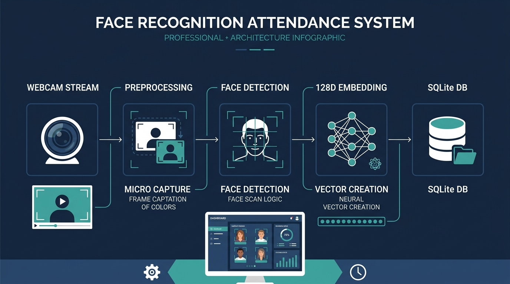

# System Architecture and Design

This document details the architectural flow, design principles, core decisions, and technical limitations of the Face Recognition Attendance Management System.

---

## 1. System Data Flow

The system processes image frames from video inputs or raw directories to generate attendance logs through three distinct steps:

```
[Camera / Directory] ──> [HOG Face Detection] ──> [dlib 128D Embedding] ──> [Euclidean Distance Match] ──> [Debounce Check] ──> [Database Write]
```



### Stage 1: Input Acquisition
- Real-time video frames are acquired using OpenCV via local webcam indices.
- Alternatively, static JPEG/PNG files are loaded from designated directories for batch processing.

### Stage 2: Feature Extraction and Search
1. Captured BGR frames are normalized and converted to RGB.
2. The **Histogram of Oriented Gradients (HOG)** algorithm localizes face regions, defining bounding box coordinates.
3. A pretrained dlib facial signature network processes the localized regions to output a **128-dimensional floating-point vector** (embedding).
4. The system calculates the Euclidean distance between this vector and the enrolled database vectors:
   $$D(p, q) = \sqrt{\sum_{i=1}^{n} (p_i - q_i)^2}$$
5. If the minimum distance calculated is below the configured threshold (default `0.6`), a positive identification is registered.

### Stage 3: Output and State Logging
- **Visual Overlays:** Color-coded bounding boxes are drawn around faces (green for recognized student profiles, red for unknown individuals) along with identifying metadata.
- **Debounce Logic:** A 3-second debounce window filters out duplicate logs for the same student during a live tracking session.
- **Persistence:** Log entries are recorded to the SQLite database and appended to plain-text logs under [`logs/attendance_log.txt`](../logs/attendance_log.txt).
- **Session End:** Absent student records are computed and written to the database once a session concludes.

---

## 2. Key Design Decisions

### SQLite3 with Pickle Serialization
To preserve lightweight deployment bounds and avoid external database daemon configuration, the application utilizes SQLite3. Face signatures (128D NumPy arrays) are structured as pickled binary BLOBs. This ensures fast write/read times while avoiding database schemas loaded with individual float columns.

### HOG-based Localization
The Histogram of Oriented Gradients (HOG) detector is employed instead of Convolutional Neural Networks (CNN) for facial localization. HOG allows processing real-time video streams on average CPU architectures without requiring discrete GPU accelerators.

### Multi-Pose Vector Averaging
During student webcam enrollment, the system records 10 distinct facial frames capturing varying angles (frontal, tilts, smiles, and profile angles). The system averages these extracted embeddings mathematically to construct a single representative vector:
$$\vec{V}_{avg} = \frac{1}{10} \sum_{k=1}^{10} \vec{v}_k$$
This mitigates face mismatch issues caused by slight lighting shifts or facial expression changes.

### Hardware-independent Simulation Mode
To allow software execution checks and database validation on headless integration environments or hardware lacks, both CLI modules and Streamlit views implement a `--simulate` parameter. This bypasses local camera drivers, feeding generated mock profiles and random arrays into downstream business layers.

---

## 3. Technical Notes and Limitations

### Localization Performance Bounds
HOG face detectors perform optimally under frontal/near-frontal angles. Accuracy degrades under severe head rotations, extreme side profiles, or dim lighting settings. CNN-based models resolve these limits but require CUDA-compatible hardware.

### Concurrency and SQLite Thread Constraints
SQLite employs simple database-level write locks. In multi-client networks where multiple recognition streams attempt to write logs concurrently, "Database Locked" errors may occur. Multi-client setups require migration to PostgreSQL or similar servers.

### Pickling Version Risks
Pickle serialization depends heavily on the Python runtime version. Database records containing pickled binary embeddings generated under one Python version may fail to unpickle if run on a different runtime. 

### Presentation and Spoofing Vulnerability
The camera interface relies on standard 2D video feeds. It is vulnerable to spoofing tricks using printed face photos or phone displays showing enrolled student portraits. Mitigating this risk requires dedicated 3D depth camera integration or software-based liveness verification.

### Authentication and Access Boundaries
The current control panel lacks access control walls or OAuth wrappers. Anyone running the dashboard locally can modify configuration files, delete databases, or enroll mock profiles.
